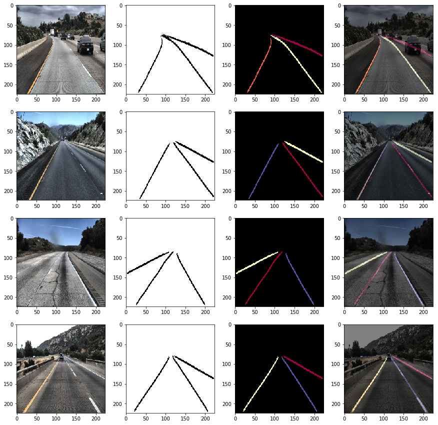
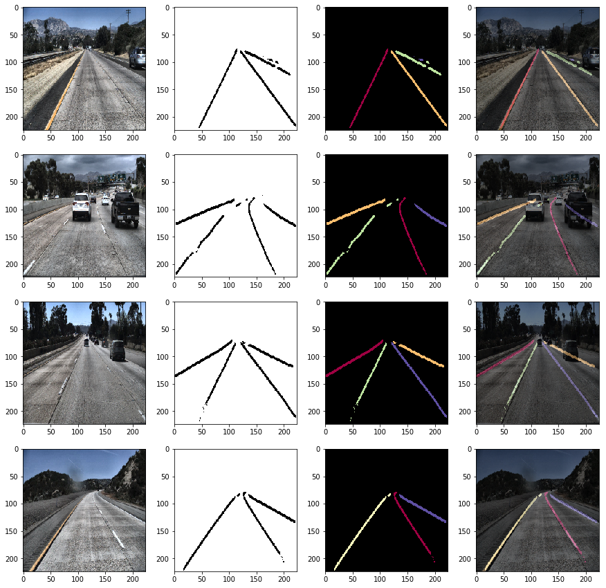

# Road-Lane-Instance-Segmentation-PyTorch
Road lane instance segmentation with PyTorch.  
  - SegNet, ENet with discriminative loss.
  - Lane clustered with DBSCAN.  
  - Trained from tuSimple dataset.
  - ROS(Robot Operating System) inference node (20Hz).

### ENet result


### SegNet result


### ROS
```bash
$ python2 ros_lane_detect.py --model-path model_best_enet.pth
```

### Train
```bash
$ mkdir logs
$ tensorboard --logdir=logs/ &
$ python3 train.py --train-path /tuSimple/train_set/ --epoch 100 --batch-size 16 --lr 0.0001 --img-size 224 224
```

### Dataset
Downloads: [tuSimple dataset](https://github.com/TuSimple/tusimple-benchmark/wiki)
#### Load Dataset
```python
train_path = '/data/tuSimple/train_set/'
train_dataset = tuSimpleDataset(train_path, size=SIZE)
train_dataloader = torch.utils.data.DataLoader(dataset=train_dataset, batch_size=BATCH_SIZE, shuffle=True, num_workers=16)
```

### Model
#### [ENet](https://github.com/jaeoh2/Road-Lane-Instance-Segmentation-PyTorch/blob/master/enet.py) summary
```
----------------------------------------------------------------
Total params: 686,058
Trainable params: 686,058
Non-trainable params: 0
----------------------------------------------------------------
Input size (MB): 0.57
Forward/backward pass size (MB): 153326.17
Params size (MB): 2.62
Estimated Total Size (MB): 153329.36
----------------------------------------------------------------
```
#### [SegNet](https://github.com/jaeoh2/Road-Lane-Instance-Segmentation-PyTorch/blob/master/segnet.py) summary
```
----------------------------------------------------------------
Total params: 29,447,047
Trainable params: 29,447,047
Non-trainable params: 0
----------------------------------------------------------------
Input size (MB): 0.57
Forward/backward pass size (MB): 688.68
Params size (MB): 112.33
Estimated Total Size (MB): 801.59
----------------------------------------------------------------
```

### References
https://github.com/nyoki-mtl/pytorch-discriminative-loss  
[Paper: Semantic Instance Segmentation with a Discriminative Loss Function](https://arxiv.org/pdf/1708.02551.pdf)

